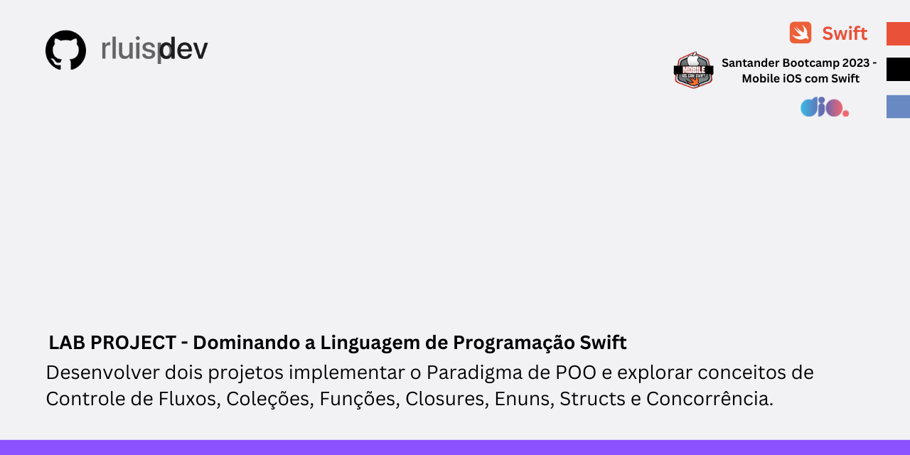

# Desafio em Swift - BootCamp Mobile Santander - DIO

## Descrição

Neste desafio, o objetivo foi desenvolver dois projetos no Playground utilizando o Xcode. Durante o desenvolvimento, foram aplicados os conceitos do **Paradigma de Programação Orientada a Objetos (POO)** e explorados os seguintes tópicos:

- **Controle de Fluxos**: Estruturas como `if`, `for`, entre outras.
- **Coleções**: Manipulação de `Array`,e outros tipos de coleções.
- **Funções: Criação e utilização de funções modularizar e reutilizar código.
- **Enums e Structs**: Definição de estruturas e enumeradores para representar dados de forma eficiente.

Os dois projetos foram implementados com foco em clareza, modularidade e melhores práticas de desenvolvimento em Swift.

---

## Objetivos do Projeto

1. **Projeto 1: Gerenciador de Tarefas**
   - Aplicar os fundamentos da POO.
   - Criar uma estrutura para gerenciar tarefas com diferentes níveis de prioridade.
   - Utilizar enums e structs para organizar dados.
   - Implementar funções para adicionar, listar e concluir tarefas.

2. **Projeto 2: Frota de Veículos**
   - Implementar o protocolo `Veiculo` para definir características comuns entre diferentes tipos de veículos.
   - Criar modelos utilizando Enums e Structs para representar carros e motos.
   - Implementar uma classe `Frota` para gerenciar veículos e filtrar por tipos.

---

## Ferramentas e Tecnologias

- **Xcode** (versão recomendada: 14 ou superior).
- **Linguagem:** Swift (versão 5.7 ou superior).
- **Playground** para prototipagem e execução dos projetos.

---

## Como Executar

1. Clone este repositório:
   ```bash
   git clone https://github.com/seu-usuario/seu-repositorio.git
   ```

2. Abra o Xcode e navegue até os arquivos `.playground`.

3. Execute o projeto utilizando o botão **Run** no canto superior esquerdo do Xcode.

---

## Instrutor
 
-   Robson Moreira - Mobile iOS Specialist, Santander - [GitHub](https://github.com/robixnai)
 

## 👨‍💻 Student
<p>
    
    <p>&nbsp&nbsp&nbsprluispdev<br>
    &nbsp&nbsp&nbsp
    <a href="https://github.com/rluispdev">
    GitHub</a>&nbsp;|&nbsp;
     <a href="https://cursos.alura.com.br/user/rluisp"> Alura Profile</a>
&nbsp;|&nbsp;
    <a href="https://www.linkedin.com/in/rafael-luis-gonzaga-b11634186/">LinkedIn</a>
&nbsp;|&nbsp;
    <a href="https://www.instagram.com/rluispdevs?igsh=cnoxenpmaHY1amE0&utm_source=qr">
    Instagram</a>
&nbsp;|&nbsp;</p>
</p>
<br/><br/>
<p>


 
## Licença

Este projeto está licenciado sob a licença MIT. Consulte o arquivo [LICENSE](LICENSE) para mais informações.
